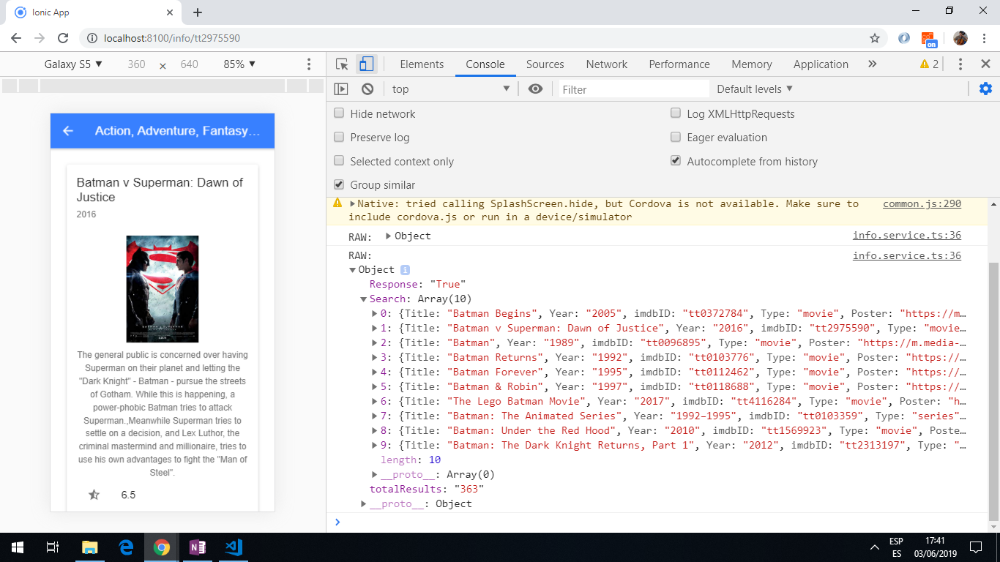

# :zap: Ionic Angular InfoApp

* App to search for info from an API and display it using the [Ionic framework](https://ionicframework.com/docs).
* Uses a [movie database API](http://www.omdbapi.com/) to develop the app.
* **Note:** to open web links in a new window use: _ctrl+click on link_


## :page_facing_up: Table of contents

* [General info](#general-info)
* [Screenshots](#screenshots)
* [Technologies](#technologies)
* [Setup](#setup)
* [Features](#features)
* [Status](#status)
* [Inspiration](#inspiration)
* [Contact](#contact)

## :books: General info

* An active search bar enables the user to search for movies, with a list of matches appearing below. Each returned movie card can be clicked on to see more details.
* The API searches the [The Open Movie Database](http://www.omdbapi.com/) for search matches.

## :camera: Screenshots




## :signal_strength: Technologies

* [Ionic v6](https://ionicframework.com/)
* [Ionic/angular v6](https://www.npmjs.com/package/@ionic/angular)
* [Angular v13](https://angular.io/) dev platform
* [OMDb API](http://www.omdbapi.com/) Open Movie Database, a RESTful web service
* Ionic DevApp, to allow app to run on an iOS or Android device.

## :floppy_disk: Setup

* Get yourself an API key from the [The Open Movie Database](http://www.omdbapi.com/) - it's free :-)
* Add your movie database access credentials to `environment.ts` for dev. work
* `npm i`
* To start the server on _localhost://8100_ type: 'ionic serve'
* The Ionic DevApp was installed on an Android device from the Google Play app store.

## :computer: Code Examples

* functions to search for info and retrieve more detailed info.

```typescript
// Get data from the Omdb Api
  // map the result to return only the results "Search" that we need
  // @param {string} title Search Term
  // @param {SearchType} type movie, series, episode or empty
  // @returns Observable with the search results
  searchData(title: string, type: SearchType): Observable<OmdbSearchResult> {
    return this.http
      .get<Observable<OmdbSearchResult>>(
        `${this.url}?&apikey=${this.apiKey}&s=${encodeURI(title)}&type=${type}`
      )
      .pipe(
        map((results) => {
          console.log("RAW: ", results);
          return results["Search"];
        })
      );
  }
  // Get detailed information using the "i" (not "id") parameter
  // @param {string} id imdbID to retrieve information
  // @returns Observable with detailed information
  getDetails(id: string): Observable<any> {
    return this.http
      .get<Observable<OmdbDetailResponse>>(
        `${this.url}?i=${id}&plot=full&apikey=${this.apiKey}`
      ).pipe(tap(res => console.log("response: ", res)))
  }
```

## :cool: Features

* Working search bar
* Ion icons look cool although I have made no attempt to optimise this app for a compact build file, otherwise I would replace with svg files
* API response interface models added
* API search function code commenting is good - I have Simon Grimm to thank for that fine example

## :clipboard: Status & To-do list

* Status: Working.
* To-do: nothing

## :clap: Inspiration

* Project inspired by [Simon Grimms's 'How to Build Your First Ionic 4 App with API Calls'](https://medium.freecodecamp.org/how-to-build-your-first-ionic-4-app-with-api-calls-f6ea747dc17a).

## :file_folder: License

* This project is licensed under the terms of the MIT license.

## :envelope: Contact

* Repo created by [ABateman](https://github.com/AndrewJBateman), email: gomezbateman@yahoo.com
